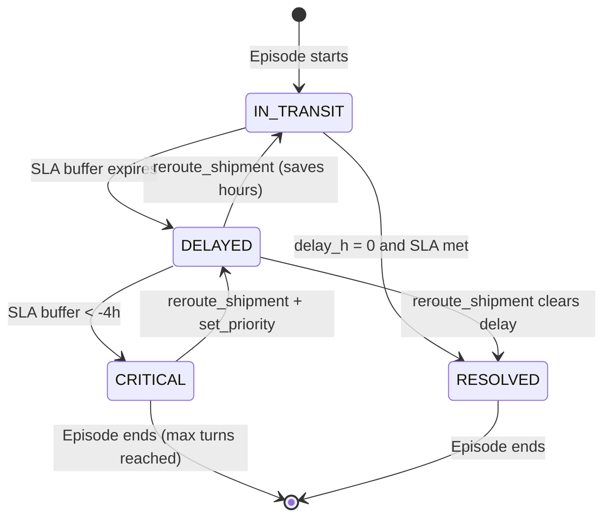

# 🚛 Logistics Shipment RL Environment

[](https://github.com/meta-pytorch/OpenEnv)
[](https://www.scaler.com/school-of-technology/meta-pytorch-hackathon)
[](https://python.org)

## 🌍 Environment Description & Motivation

**Description:** The Logistics Shipment Environment (`logistics_shipment_env`) is a complex, multi-turn resource allocation simulator where an AI agent acts as a centralized logistics coordinator. The environment dynamically simulates a deteriorating subset of the Indian freight network facing overlapping disruptions (port strikes, weather hazards, accidents). The AI must triage delayed shipments, intelligently reroute critically stranded cargo, and empathetically communicate updated ETAs to customers before SLAs are breached.

**Motivation:** The global supply chain loses billions of dollars annually to unpredictable disruptions that human dispatchers struggle to triage fast enough. The motivation behind this environment is to provide a rigorous, highly-penalizing benchmark to train Large Language Models (LLMs) to perform realtime crisis-management. By forcing the agent to balance hard mathematical constraints (hours saved vs. baseline) with soft-skills (communicating empathetically with impacted customers), this environment directly tests an AI's ability to act as autonomous operational infrastructure.

---

## 🗂️ Action Space

| Action | Arguments | Description |
|--------|-----------|-------------|
| `get_network_status` | none | Full shipment + disruption snapshot |
| `reroute_shipment` | `shipment_id`, `new_route`, `new_carrier`, `reason` | Re-assign shipment to alternate route |
| `set_priority` | `priority_ids` (list, max 3) | Fast-track critical shipments |
| `communicate_eta` | `shipment_id`, `message` | Graded customer-facing ETA update |
| `escalate` | `shipment_id`, `reason` | Flag for human dispatcher (-0.1 penalty) |
| `end_turn` | none | Commit all decisions → receive turn reward |

---

## 👁️ Observation Space

Each step returns a `LogisticsObservation` (Pydantic model):

| Field | Type | Description |
|-------|------|-------------|
| `task` | str | Active task ID (TASK-EASY/MEDIUM/HARD) |
| `turn` | int | Current turn number |
| `max_turns` | int | Turn limit for this task |
| `disruptions` | list[str] | Active disruption descriptions |
| `shipments` | list[dict] | All shipments with delay, SLA, status |
| `feedback` | str | Result of last action |
| `incremental_reward` | float | Step-level reward signal |
| `cumulative_reward` | float | Running total reward |
| `done` | bool | Whether episode is complete |

---

## 🏆 Reward Function

Incremental rewards are provided at **every step** (not just end of episode):

| Dimension | Weight | Signal |
|-----------|--------|--------|
| Delay Reduction | 40% | Hours saved vs. baseline |
| SLA Compliance | 30% | % shipments meeting deadline |
| Communication Quality | 20% | NLP scoring of ETA messages |
| Escalation Control | 10% | Penalty: -0.1 per escalation |

**Incremental rewards:**
- `reroute_shipment`: up to +0.15 per action based on congestion relief
- `communicate_eta`: up to +0.10 based on message quality (apology + ETA + reason)
- `set_priority`: +0.03 per correctly prioritized shipment
- `escalate`: -0.10 penalty

---

## 📊 Task Difficulties

| Task | Name | Shipments | Turns | Challenge |
|------|------|-----------|-------|-----------|
| `TASK-EASY` | Port Backlog Clearance | 2 | 3 | Single port disruption |
| `TASK-MEDIUM` | Mumbai Crisis Coordination | 4 | 5 | Port + accident + strike |
| `TASK-HARD` | Multi-Port Network Collapse | 7 | 7 | 3 simultaneous port failures |

---

## 📈 Baseline Scores

Scores achieved by `llama-3.1-8b-instant` via Groq:

| Task | Score |
|------|-------|
| TASK-EASY | 0.52 |
| TASK-MEDIUM | 0.41 |
| TASK-HARD | 0.28 |
| **Average** | **0.40** |

---

## 🚀 Setup & Running

### Requirements
- Python 3.10+
- `pip install openai pydantic python-dotenv`

### Run Inference

```bash
git clone https://github.com/meta-pytorch/OpenEnv
cd OpenEnv

# Set your API key (or use a .env file)
export OPENAI_API_KEY="your-groq-or-openai-key"
export API_BASE_URL="https://api.groq.com/openai/v1"   # free!
export MODEL_NAME="llama-3.1-8b-instant"

python inference.py
```

### Using .env File (Recommended)

Create a `.env` file in the OpenEnv root:
```
API_BASE_URL="https://api.groq.com/openai/v1"
MODEL_NAME="llama-3.1-8b-instant"
OPENAI_API_KEY="gsk_your_free_groq_key"
```

Then simply run:
```bash
python inference.py
```

### Environment Variables

| Variable | Default | Description |
|----------|---------|-------------|
| `OPENAI_API_KEY` | *(required)* | Your API key (Groq or OpenAI) |
| `API_BASE_URL` | `https://api.openai.com/v1` | LLM endpoint |
| `MODEL_NAME` | `gpt-4o-mini` | Model name |
| `TASK_ID` | `TASK-MEDIUM` | Which task to run |
| `MAX_TURNS` | `7` | Max turns per episode |

---

## 🐳 Docker / HuggingFace Spaces Deployment

The `server/Dockerfile` is ready for HuggingFace Spaces (port 7860):

```bash
# Build locally to test
docker build -t logistics-env ./envs/logistics_shipment_env/server
docker run -p 7860:7860 logistics-env
```

Deploy to HuggingFace:
1. Create a new **Docker Space** at [huggingface.co/new-space](https://huggingface.co/new-space)
2. Tag it with `openenv`
3. Upload the `envs/logistics_shipment_env/` directory contents


---

## 🗺️ Shipment State Transitions



---

## 🎬 Example Episode Transcript

```
[START] task=TASK-MEDIUM env=logistics_shipment_env model=llama-3.1-8b-instant

[STEP 1] action=get_network_status          reward=+0.01  done=false
[STEP 2] action=set_priority                reward=+0.06  done=false
         → SHIP-001, SHIP-003 flagged as priority ✓
[STEP 3] action=reroute_shipment            reward=+0.20  done=false
         → SHIP-001: R1(heavy) → R2(light)  saved 2.5h  SLA breach avoided
[STEP 4] action=communicate_eta             reward=+0.12  done=false
         → SHIP-001: "We sincerely apologise… arrival by 6pm…"  quality=1.0
[STEP 5] action=reroute_shipment            reward=+0.15  done=false
         → SHIP-003: R1(heavy) → R2(light)  saved 2.5h
[STEP 6] action=end_turn                    reward=+0.74  done=false
         Turn score: delay=0.91 sla=0.75 comm=0.90 esc=1.00

[STEP 7] action=get_network_status          reward=+0.01  done=false
[STEP 8] action=communicate_eta             reward=+0.12  done=false
[STEP 9] action=end_turn                    reward=+0.65  done=true

[END] success=true steps=9 score=0.712 rewards=0.74,0.65
```

---

## 🧪 Running Tests

```bash
pip install pytest
pytest tests/ -v
```

Expected output: **30+ tests passing** covering all actions, reward bounds, and data integrity.

---

## 🎮 Live Interactive Demo

Open `dashboard.html` directly in your browser — no server required:

```bash
# Simply open it (works with the live HuggingFace Space)
start dashboard.html    # Windows
open dashboard.html     # Mac
```

Or test via the terminal demo client:

```bash
python examples/demo.py
python examples/demo.py --task TASK-HARD
python examples/demo.py --url http://localhost:8000
```

---

## 📁 Project Structure

```
logistics_shipment_env/
├── inference.py            # 🤖 Baseline agent (hackathon grader entry point)
├── dashboard.html          # 🎨 Live visual dashboard (open in browser)
├── openenv.yaml            # 📋 Environment manifest
├── pyproject.toml          # 📦 pip-installable package
├── README.md               # 📖 This file
├── DESIGN.md               # 🏗️ Architecture decisions & reward anatomy
├── CONTRIBUTING.md         # 🤝 How to add scenarios, routes, actions
├── CITATION.md             # 📚 BibTeX citation
├── server/
│   ├── app.py              # 🌐 FastAPI server
│   ├── environment.py      # ⚙️ Core RL engine (Pydantic models + rewards)
│   └── grader.py           # 🏆 Reward calculator helpers
├── examples/
│   ├── demo.py             # 🚀 Zero-setup interactive demo
│   └── train_grpo.py       # 🧠 GRPO training starter script
└── tests/
    └── test_environment.py # ✅ 30+ pytest unit tests
```

---

## 📚 Further Reading

- [DESIGN.md](./DESIGN.md) — Architecture decisions, reward anatomy, known limitations
- [CONTRIBUTING.md](./CONTRIBUTING.md) — How to add new scenarios, routes, and actions
- [CITATION.md](./CITATION.md) — BibTeX for academic citation

## 🔗 Links

- [🤗 Live HuggingFace Space](https://huggingface.co/spaces/Leavin1611/logistics-hackathon-env)
- [📦 GitHub Repository](https://github.com/leavin1611/Leavin1611-logistics-hackathon-env)
- [OpenEnv Framework](https://github.com/meta-pytorch/OpenEnv)
- [Meta PyTorch Hackathon](https://www.scaler.com/school-of-technology/meta-pytorch-hackathon)
- [Get Free Groq API Key](https://console.groq.com/keys)

